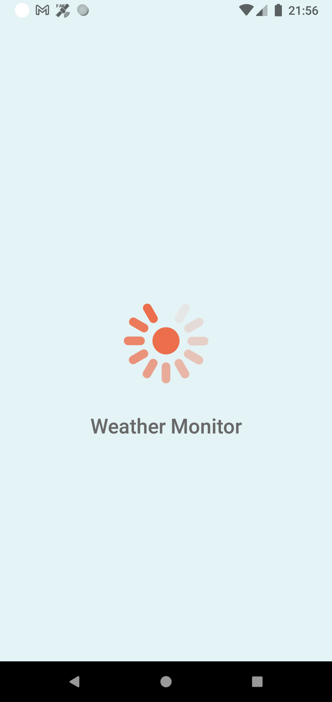
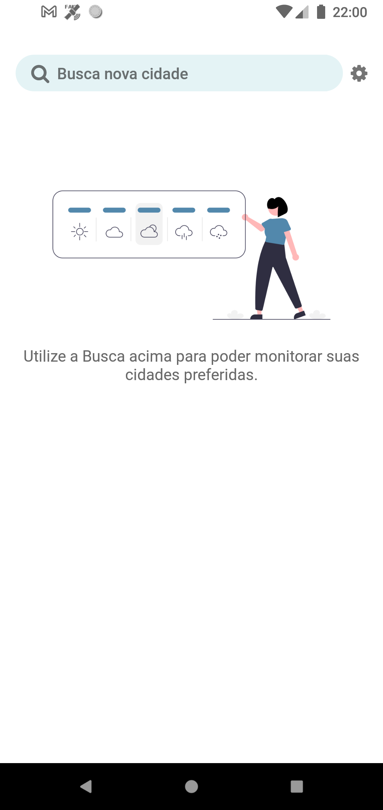
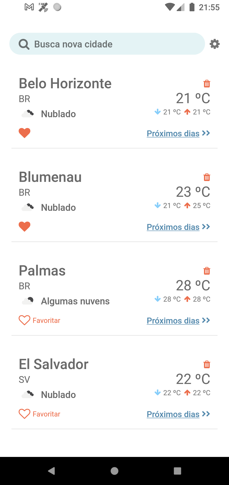
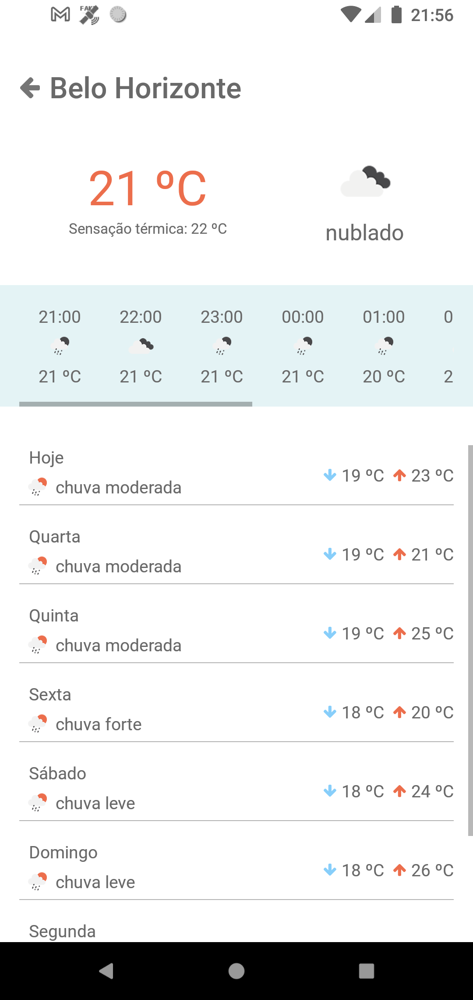
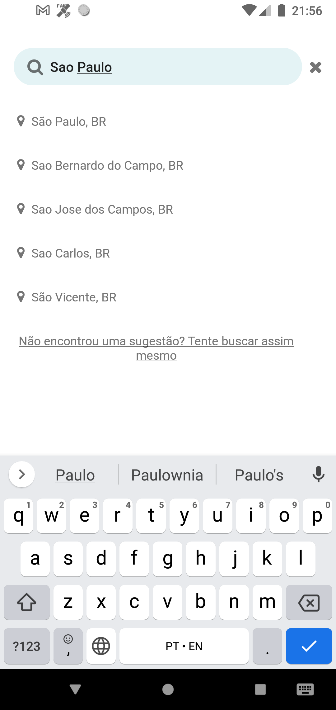
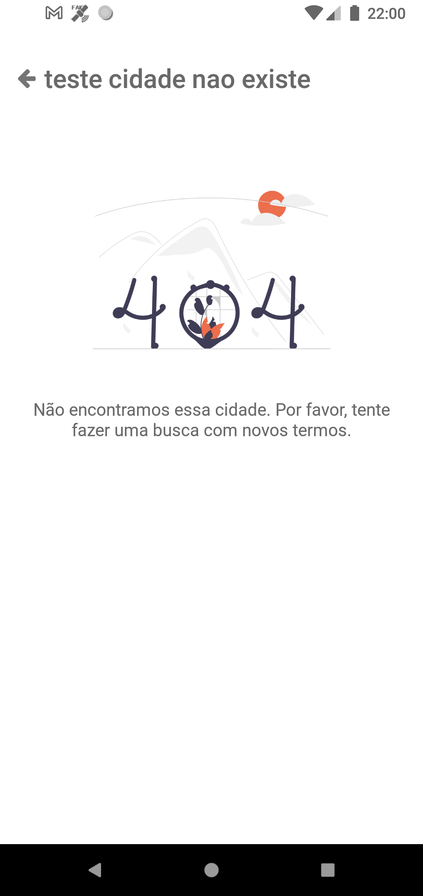
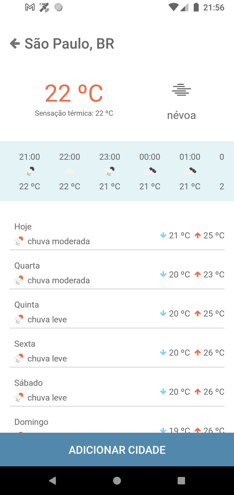

# WeatherMonitor

Aplicativo para consultar o clima de diversas cidades, mantendo uma lista de cidades salvas.

APIs escolhidas
-------------
1. Open Weather Map - para monitorar o clima de diversas cidades
2. Geocode Earth - usada no autocomplete da busca de cidades (o Google Places oferece um serviço melhor e mais preciso, mas é necessário um cartão de crédito para cadastro, por isso ficou mais fácil utilizar o Geocode Earth - que é de graça por 14 dias). 

Observação: caso alguma api esteja retornando erro, basta trocar as chaves no arquivo ./src/utils/constants.js, ambas plataformas dispibonilizam testes gratuitos limitados.

Principais tecnologias utilizadas
-------------
1. Redux
2. AsyncStorage
3. Axios
4. React-navigation

Telas do APP
-------------
1. Splash
2. Lista Cidades
3. Busca
4. Detalhes da Cidade

Prints
-------------

	
  
  
  
  
  
  
  

